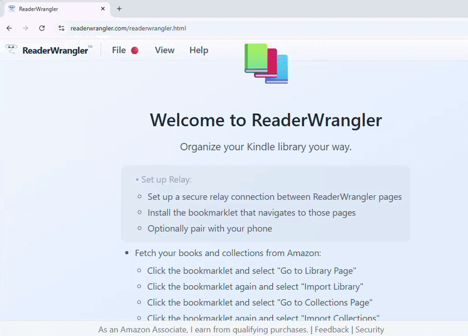

# ReaderWrangler™

## Organize your Kindle library visually

**The problem:** You have hundreds (or thousands) of Kindle books. Your Kindle library on Amazon shows beautiful covers but won't let you organize them. Great reads get buried.

**The solution:** ReaderWrangler imports your Amazon Kindle library and lets you organize it with drag-and-drop folders—like a file manager for your reading list. Then browse your curated library on your phone.

**[Get Started](https://readerwrangler.com/readerwrangler.html)** | **[Launch App](https://readerwrangler.com/readerwrangler.html)** | **[Watch Demo](https://readerwrangler.com/images/walk-through.mp4)**

---

## Your Books, Your Order

See all your [Kindle books](https://www.amazon.com/yourbooks) in one dashboard—covers, ratings, descriptions, and reviews. Organize with nested folders like Author / Series / Books (think Artist / Album / Song), tag books as "Next to Read" or "Time Travel," and double-click any cover to see full details. An All Books view lets you browse, filter, and sort your entire library at any time—your organization never hides anything.

  

Just drag the button to your bookmarks bar, and you're ready to go.

---

## Quick Start

### 1. Install the Bookmarklet (One Time)

A. **Visit the [Get Started](https://readerwrangler.com/readerwrangler.html) page**

B. **Drag the button to your bookmarks bar**

### 2. Import Your Library from Amazon

A. **Click the bookmarklet** and select "Go to Library Page"

B. **Click the bookmarklet again** and select "Import Library"

C. **Click the bookmarklet** and select "Go to Collections Page"

D. **Click the bookmarklet again** and select "Import Collections"

**💡 Keeping Your Library Current:** Do this once to get your complete library, then repeat occasionally to add newly purchased books and refresh your collections. ReaderWrangler merges new books while preserving your organization.

### 3. Start Organizing!

A. **Click the bookmarklet** and select "Launch App"

B. **Your library arrives automatically through the relay**

**🔒 Your Privacy:** All processing happens in your browser—your data never leaves your computer.

---

## Why ReaderWrangler?

| | |
|---|---|
| **Unbury your next great read.** | **Amazon shows you all your books online, but won't let you organize them.** |
| If you're like most book lovers, your ebook library has grown to hundreds—even thousands—of books. You buy new titles faster than you can read them, and buried in that digital pile are gems you've completely forgotten about. That book you were excited to read last year? Lost in the shuffle. The entire series you meant to binge? Scattered and out of order. | Amazon's "Your Books" page displays beautiful thumbnails with ratings and reviews, but there's a critical problem: you can't reorder them or group them in meaningful ways. With a massive library, it's impossible to keep track of what you own, what you've read, and what's next on your list. |
| **ReaderWrangler gives you the control Amazon doesn't.** | **Then the magic happens.** |
| ReaderWrangler is a free web app that imports your Amazon Kindle library and transforms it into an organized, personalized reading dashboard—on your computer and your phone. Using a simple bookmarklet, you import your complete library—covers, ratings, reviews, and descriptions—all in one place. No local ebook files required. No manual exports. Simple and straightforward. | **You** build a folder hierarchy that fits how you think—by author, by series, by mood, whatever works. Or let Auto-Organize do it for you: it builds an Author / Series / Books structure automatically, one book at a time or your entire library at once. Tag books as "Next to Read," "Favorites," or "Beach Reads" for cross-cutting themes. Pin your favorite tags as virtual folders for instant access. Drag and drop books between folders, reorder them within a folder, and use multi-select to move entire series at once. Search by author or title to quickly find and organize specific books. Double-click any book cover to see its full details—larger cover image, title, author, Amazon rating, description, and top reviews—then navigate through your filtered results without leaving the detail view. |

---

## See the Difference

From chaos to control - slide to compare Amazon's view vs. ReaderWrangler

 

*Note: In the live website, this is an interactive slider you can drag left/right*

---

## Key Features

| | |
|---|---|
| **Works With Your Amazon Library** | **Library Management** |
| • See all your Kindle books in one visual dashboard • Covers, ratings, reviews, and descriptions all in one place • No manual CSV exports or local ebook files required • Works with your Amazon library page | • View your entire ebook library with titles, authors, covers, descriptions, and ratings • Advanced filtering by author, series, genre, and reading status • Smart search across titles and authors • **Wishlist** - Add books from Amazon to track what you want to buy |
| **Organization (Desktop)** | **Data & Privacy** |
| • Drag-and-drop interface for organizing books into folders • Multi-select with Ctrl/Shift for bulk operations • Nested folder hierarchy with Auto-Organize • **Tags & Tag Views** - Label books across folders; pin tags as virtual folders • **Hide books** - Soft-delete books you don't want to see • **Context menu** - Right-click for quick actions (Open in Amazon, Copy Title) | • End-to-end encrypted relay keeps your data secure • IndexedDB storage for persistent local storage • Export your organization to JSON for backup |
| **Mobile Viewer** | |
| • Browse your organized library on any phone • Dashboard shelves, folder navigation, tag views • Search, sort, and view full book details • Add to home screen for app-like experience | |

**Your books, your order. Finally!**

Rediscover forgotten treasures, prioritize your reading stack, and organize the chaos into a system that actually works for you. Never lose track of what to read next. Take command of your reading life.

---

## How It Works

**1. Import Your Kindle Library**

Your Amazon Kindle library already has your complete collection. Install the bookmarklet, visit your Amazon library page, and import your books and collections—covers, descriptions, ratings, and reviews—securely through an encrypted relay to your ReaderWrangler app.

⏱️ The initial import may take a while depending on your library size, but you only need to do it once

🔒 Transferred through an encrypted relay—no files to manage

**2. Organize Your Collection**

Launch ReaderWrangler and your imported library is already there—delivered securely through the relay. Instantly see all your books in a visual grid. Now the fun begins—run Auto-Organize to build an Author / Series / Books hierarchy, drag books between folders, tag them however you like, and finally take control of your reading chaos.

**3. Keep It Fresh**

Bought new books on Amazon? Just run the bookmarklet again—your updated library syncs automatically through the encrypted relay. ReaderWrangler merges the new additions while preserving your organization. Your folders, tags, and sort order stay intact while your library stays current.

**4. Browse on Mobile**

Pair your phone by scanning a QR code in the app. Your folders, tags, and organization sync automatically—browse your curated library from anywhere.

📱 Add to your home screen for an app-like experience

🖥️ All organizing happens on desktop. Mobile is your read-only companion for browsing.

**💡 Smart Recovery:** Sometimes a few book details get missed during the initial import. No worries! Every time you refresh your library, ReaderWrangler re-attempts any missing descriptions or reviews. Your library gets more complete with each update.

---

## Current Support

Amazon Kindle™ Library

**Tested browsers:** Chrome, Edge, Firefox. Safari is untested.

---

## What Makes ReaderWrangler Different?

ReaderWrangler is the **only tool specifically designed for Amazon Kindle libraries**. While other excellent ebook management tools exist, they all require local ebook files—meaning you need to download, export, or manually manage files on your computer. ReaderWrangler takes a completely different approach.

| | |
|---|---|
| **The Only Tool for Amazon Kindle Libraries** | **Zero Installation Required** |
| All other ebook organizers require local files. ReaderWrangler works with your Amazon library directly—no files to download, no exports to manage. | While competitors require Docker, Python, CLI tools, or desktop applications, ReaderWrangler is just a bookmarklet and a webpage. Visit, drag, click, organize. That's it. |
| **Your Data Stays Secure** | **No Technical Knowledge Needed** |
| Your library is encrypted end-to-end and transferred through a secure relay. Your encryption keys never leave your devices—no accounts, no cloud storage, no tracking. | No command line. No configuration files. No server setup. If you can drag a bookmark and click a button, you can use ReaderWrangler. |
| **Complementary, Not Competitive** | |
| ReaderWrangler doesn't replace file-based ebook managers—it complements them. Use tools like Calibre or organize-ebooks for your local files, and use ReaderWrangler for your Amazon Kindle library. | |

---

## Recent Features

**v5.5 - Mobile Viewer** (February 2026)
- Browse your organized library on your phone — dashboard shelves, folder navigation, tag views, search & sort

**v5.5 - Tag Virtual Folders** (February 2026)
- Pin any tag as a virtual folder alongside real folders; drag-to-tag, manual ordering, move/copy between views

**v5.5 - Dark Mode + High Contrast Themes** (February 2026)
- Four themes: Light, Dark, High Contrast Light, High Contrast Dark
- Auto-detects OS preference, 25 semantic CSS variables, every UI element themed

**v5.1 - Auto-Organize Wizard** (February 2026)
- One-click folder creation by author and series from your Inbox
- Preview mode, configurable thresholds, and single Ctrl+Z to undo the whole operation

**v5.0 - Book Explorer** (February 2026)
- Complete redesign: two-pane Windows Explorer-style interface with folder tree + content view
- Nested folders, list and cover grid views, drag-and-drop, context menus, Cut/Copy/Paste
- Menu bar + compact toolbar — 32% more screen space for books

**v4.17 - Wishlist Price Goals** (January 2026)
- Set price triggers on wishlist books and filter to "Deals" when prices drop to your target

**v4.21/v4.23 - Series & Author Bulk Import** (January 2026)
- One-click import of entire book series or author bibliographies to your wishlist

**v4.8/v4.16 - Cut/Copy/Paste + Undo/Redo** (January 2026)
- Full clipboard operations (Ctrl+X/C/V) and unlimited undo/redo (Ctrl+Z/Y) for all actions

See [CHANGELOG.md](CHANGELOG.md) for complete version history.

---

## Coming Soon!

- **Public launch** — Share ReaderWrangler with the world

Have a feature request? [Let us know on GitHub!](https://github.com/Ron-L/ReaderWrangler/issues)

---

## Documentation

- [USER-GUIDE.md](USER-GUIDE.md) - Complete user guide with tips, workflows, and troubleshooting
- [CHANGELOG.md](CHANGELOG.md) - Version history and release notes
- [CONTRIBUTING.md](CONTRIBUTING.md) - Development guide for contributors
- [TODO.md](TODO.md) - Planned features and known issues
- [COMPETITIVE-ANALYSIS.md](COMPETITIVE-ANALYSIS.md) - Comparison with other ebook library management tools

---

Questions or issues? Check the [documentation](CONTRIBUTING.md) or [open an issue on GitHub](https://github.com/Ron-L/ReaderWrangler/issues).

---

## See ReaderWrangler in Action

Watch this 10-minute walkthrough to see all the features in action

<a href="https://readerwrangler.com/images/walk-through.mp4">
  
  
▶️ Click to watch full 10-minute walkthrough (opens video in new tab)

</a>

---

## Author

Ron-L

---

## License

ReaderWrangler is licensed under the **MIT License with Commons Clause**.

**What does this mean?**

You're free to use ReaderWrangler for personal use, explore the code, learn from it, and even modify it for your own needs. However, you cannot use this code to create a competing commercial product or service.

This license protects the project while keeping the source code transparent and accessible. If you're interested in contributing improvements, pull requests are welcome!

See [LICENSE.md](LICENSE.md) for full details.

**Trademarks**

ReaderWrangler™ and Alloid Labs™ are trademarks of Ron Lewis. Access to the source code does not grant rights to use these names for derivative works.

---

## Notice

Amazon, Kindle, and Amazon Kindle are trademarks of Amazon.com, Inc.

ReaderWrangler™ is not affiliated with, endorsed by, or sponsored by Amazon.

Special thanks to [FreeDNS](https://freedns.afraid.org/) for providing free DNS hosting.
