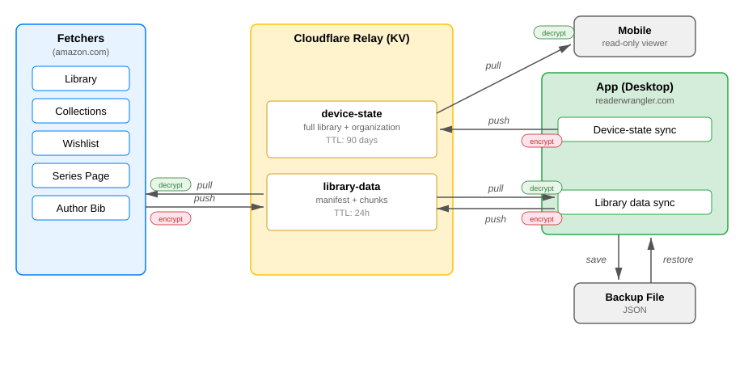

# ReaderWrangler Architecture

## Tech Stack

- **Frontend:** React 18 (via CDN), Tailwind CSS (via CDN), Babel (via CDN)
- **Backend:** Cloudflare Workers + KV (encrypted relay for cross-domain transfer)
- **Storage:** IndexedDB for book data, localStorage for organization state (see Storage Architecture below)
- **File Format:** Single HTML file (no build process), shared JS modules loaded as globals

## File Inventory

| File | Purpose | Version Constant |
|------|---------|-----------------|
| `readerwrangler.html` | Entry point, viewport detection, script loading | `APP_VERSION` |
| `readerwrangler.js` | Desktop app (React/JSX, needs Babel) | `ORGANIZER_VERSION` |
| `mobile.js` | Mobile viewer (React/JSX, needs Babel) | `MOBILE_VERSION` |
| `readerwrangler.css` | Desktop styles (CSS variables for themes) | — |
| `uiHelpers.js` | Shared constants, localStorage keys, utilities | — |
| `storage.js` | Shared IndexedDB operations | — |
| `relay-crypto.js` | AES-256-GCM encrypt/decrypt (Web Crypto API) | — |
| `relay-compress.js` | Gzip compress/decompress (CompressionStream API) | — |
| `relay-client.js` | Relay upload/download orchestration | — |
| `bookmarklet-nav-hub.js` | Navigator dialog (runs on amazon.com) | `NAV_HUB_VERSION` |
| `amazon-library-fetcher.js` | Fetch Kindle library from Amazon | `FETCHER_VERSION` |
| `amazon-collections-fetcher.js` | Fetch collections/read status | `FETCHER_VERSION` |
| `amazon-wishlist-fetcher.js` | Add product to wishlist | `FETCHER_VERSION` |
| `author-bibliography-fetcher.js` | Add author's bibliography to wishlist | `FETCHER_VERSION` |
| `series-page-fetcher.js` | Add series books to wishlist | `FETCHER_VERSION` |
| `relay/relay-worker.js` | Cloudflare Worker (KV relay endpoints) | — |
| `relay/wrangler.toml` | Worker deployment config | — |
| `manifest.json` | PWA manifest | — |

## Data Flow

### System Overview



### Data Flow Summary

| Path | From | To | Mechanism | Data |
|------|------|----|-----------|------|
| Fetch baseline | Relay | Fetchers | pull (decrypt existing) | Existing library as merge baseline |
| Fetch upload | Fetchers | Relay | push (encrypted chunks) | Library, collections, wishlist |
| Import | Relay | App | pull + delete | Library data → merge into IndexedDB |
| Permanent delete | App | Relay | push (full re-upload) | Entire library minus deleted books, in fetcher format |
| Mobile sync | App → Relay | Mobile | push, then pull | Full library + organization snapshot |
| Backup save | App | File | JSON download | Books + organization + relay credentials |
| Backup restore | File | App | JSON upload | Merge into IndexedDB + push device-state to relay |

### Key Design Points

- **Fetchers pull then push.** They download the existing library as a baseline, merge new data, then upload encrypted chunks and a plaintext manifest.
- **App pulls and pushes library data.** Pulls on demand (File → Import from Relay), pushes after permanent deletes (full re-upload minus deleted books).
- **App pushes device-state** after every import and backup restore, keeping mobile in sync.
- **Mobile only pulls.** It reads device-state from relay. It never writes back.
- **Backup is the only file-based path.** All routine data transfer goes through the relay.
- **Relay credentials are included in backup files** so they survive a full app reset.

## Cloudflare Relay Architecture

### Overview

A Cloudflare Worker serves as the bidirectional, cross-domain relay between the bookmarklet (amazon.com) and the app (readerwrangler.com), as well as between the app and mobile viewer. All data (except the manifest, which contains only non-sensitive metadata) is encrypted client-side before transit and remains encrypted at rest in Cloudflare KV.

### Worker URL

`https://readerwrangler-relay.readerwrangler.workers.dev`

### KV Key Layout

```
relay:{channelId}:manifest       → upload manifest (TTL: 24h, plaintext JSON)
relay:{channelId}:chunk:{n}      → encrypted compressed library data (TTL: 24h)
relay:{channelId}:device-state   → encrypted full library snapshot (TTL: 90 days)
```

### Permanent Delete → Relay Sync

When books are permanently deleted, the app re-uploads the entire library to the relay in fetcher format. This overwrites the relay data with the library minus the deleted books. Next time a fetcher runs, it downloads this as the baseline and merges in books found on Amazon.

**Limitation:** This only prevents reappearance for books that are also gone from Amazon (expired borrows, removed wishlist items). Purchased books still in Amazon's library will be re-fetched and re-added. The app warns users at trash time if they're deleting a purchased book and suggests using Hide instead.

### Security Model

- **Channel ID** — UUID generated by the app. Acts as access token for all KV operations. 122 bits of entropy.
- **Passphrase** — Random 32-character string generated at setup. Baked into bookmarklet code. Used as AES-256-GCM key material (derived via PBKDF2).
- **Encryption** — All chunk data encrypted client-side. Worker only sees ciphertext. Manifest is plaintext (app reads bookCount/timestamp for UI).
- **CORS** — Worker only accepts requests from whitelisted origins.

### Relay Modules

Three vanilla JS modules loaded as globals (no build step):

| Module | Global | Purpose |
|--------|--------|---------|
| `relay-crypto.js` | `window.RWCrypto` | PBKDF2 key derivation, AES-256-GCM encrypt/decrypt |
| `relay-compress.js` | `window.RWCompress` | Gzip via browser-native CompressionStream |
| `relay-client.js` | `window.RWRelay` | Upload/download orchestration, chunking, status check |

### Bookmarklet Credential Injection

The relay-enabled bookmarklet has credentials baked in as string literals:
```javascript
window._RW_RELAY_CHANNEL = '<channelId>';
window._RW_RELAY_PASSPHRASE = '<passphrase>';
```

The nav-hub detects these globals and chains relay module loading before the fetcher script. Relay is required — fetchers will not function without valid relay credentials.

## Mobile Viewer

- **File:** `mobile.js` with `MOBILE_VERSION` constant
- **Loading:** `readerwrangler.html` detects viewport width < 768px and loads `mobile.js` instead of `readerwrangler.js`
- **Desktop override:** `readerwrangler-desktopMode` localStorage flag forces desktop on mobile viewport
- **Shared modules:** `storage.js` (IndexedDB), `uiHelpers.js` (localStorage keys, utilities)
- **Mobile prefs:** stored in `readerwrangler-mobile-prefs` localStorage key
- **Read-only:** Mobile is a reference viewer, not for curation. No write-back to relay.

## Storage Architecture

| Data Type | Storage | Why |
|-----------|---------|-----|
| Book data | IndexedDB | Large datasets, auto-save on every action |
| Organization (folders, tags, explorer settings) | localStorage | Instant load, no user interaction |
| Relay credentials (channelId, passphrase) | localStorage | Persistent across sessions |
| Library transfer (cross-domain) | Cloudflare KV (24h TTL) | Encrypted relay between amazon.com and readerwrangler.com |
| Mobile sync (device-state) | Cloudflare KV (90-day TTL) | Full library snapshot for mobile viewer |
| Backup/restore | JSON file save/restore | Portability, disaster recovery |

### The Cross-Domain Problem

The bookmarklet runs on Amazon.com while the app runs on readerwrangler.com. Browser security (Same-Origin Policy) prevents direct storage sharing.

**Solution:** Cloudflare Workers + KV relay. The bookmarklet encrypts and uploads library data to KV; the app downloads, decrypts, and stores in IndexedDB.

### Backup/Restore

- **IndexedDB + localStorage**: Runtime persistence (automatic, seamless)
- **JSON Save/Restore**: Explicit save/restore for portability, disaster recovery (File → Save Backup / Restore Backup)
- **Relay credentials** are included in backup files so they survive a full app reset
- **Restore syncs to relay**: After restoring a backup, the app automatically pushes device-state to relay if configured

## Version Management

Each code file has its own version constant for tracking changes during code/test cycles:
- **APP_VERSION** in readerwrangler.html — User-facing release version, drives cache busting for JS/CSS
- **ORGANIZER_VERSION** in readerwrangler.js — Desktop app build version, incremented with each alpha iteration
- **MOBILE_VERSION** in mobile.js — Mobile viewer build version
- **FETCHER_VERSION** in fetcher files — Data fetching utilities
- **NAV_HUB_VERSION** in bookmarklet-nav-hub.js — Navigator dialog version

**Semver pre-release convention:** `-alpha.N` suffix increments with each test iteration, dropped at release.

## Status Icons (Critical Pattern)

- Pre-load ALL 5 icons in DOM simultaneously
- Toggle visibility with CSS `display: none/inline-block`
- **NEVER change `src` attribute** (causes 30-60s browser lag)
- See CHANGELOG Technical Notes for failed approaches

### Icon Display Lag (Lessons Learned)
- Changing `src` attribute causes 30-60s lag
- Using `key` prop causes blank icon during mount/unmount
- Cache-busting on image src doesn't help
- Solution: Pre-load all icons, toggle CSS display property

## Cache-Busting

### Main Application (readerwrangler.html + readerwrangler.js)

**Production cache busting** (version-based):
- `APP_VERSION` defined ONCE in readerwrangler.html (line ~34)
- Dynamic script loading: `readerwrangler.js?v={APP_VERSION}`
- readerwrangler.js reads version from query param (no duplication!)
- Updated on each release to force browsers to fetch new code

**Developer workflow:**
- During alpha development: Cache-buster stays at current APP_VERSION
- Use **hard refresh** (Ctrl+Shift+R / Cmd+Shift+R) to see code changes
- At release: Update APP_VERSION in readerwrangler.html only (single source of truth)
- JavaScript automatically uses the version from HTML (no duplication to maintain)

**Why not Date.now() for production?**
- Would bypass cache on every page load
- Measured: 13 seconds (cached) vs 17 seconds (uncached) load time
- Version-based cache busting only invalidates on actual releases

### Navigator Scripts (bookmarklet-nav-hub.js)

**Environment-based cache busting:**
```javascript
const IS_DEV_MODE = TARGET_ENV !== 'PROD';  // Line 46
const cacheBuster = IS_DEV_MODE ? '?v=' + Date.now() : '';  // Line 214
```

**Behavior:**
- LOCAL: `Date.now()` cache busting (rapid iteration)
- DEV: `Date.now()` cache busting (GitHub Pages testing)
- PROD: No cache busting (stable, cached for users)

## Three-Environment Testing

**Environments:**
| Environment | URL | Bookmarklet | Use Case |
|-------------|-----|-------------|----------|
| LOCAL | localhost:8000 | ⚠️ LOCAL (orange) | Rapid iteration, instant feedback |
| DEV | ron-l.github.io/readerwranglerdev | 🔧 DEV (blue) | Test GitHub Pages deployment |
| PROD | readerwrangler.com | 📚 ReaderWrangler (purple) | Production users |

**Bookmarklet generation:**
Bookmarklets are generated in-app via **File → Relay Setup**. Relay credentials (channelId + passphrase) are baked into the bookmarklet code as string literals. Each environment's bookmarklet loads scripts from its respective origin.

**Testing workflow:**
1. Start local server in the project directory: `python -m http.server 8000`
2. Open the app, go to File → Relay Setup to generate bookmarklet
3. On Amazon, click bookmarklet to test fetcher → relay → app flow
