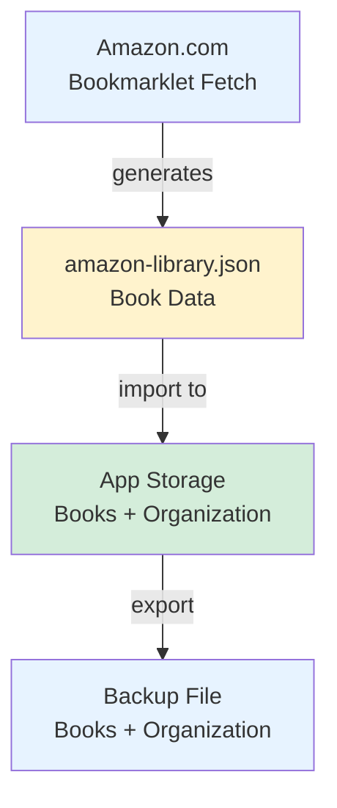
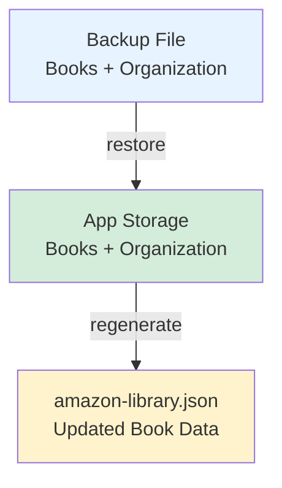
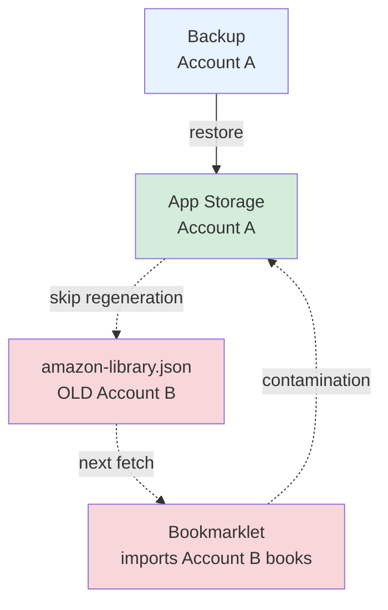

# Backup and Restore Data Flow

**Purpose:** Document how data flows through the ReaderWrangler system during normal operation and backup/restore workflows.

**Audience:** Developers debugging restore issues, contributors understanding system architecture

---

## Quick Summary

ReaderWrangler maintains TWO separate data stores:
1. **amazon-library.json** - Raw book data (fetched from Amazon)
2. **App Storage** - Organization (folders, tags, notes, sort order, price goals)

The restore workflow requires updating BOTH to keep them in sync.

---

## Data Flow Diagrams

### Normal Flow: Fetch → Import → Backup



**Flow:** User runs bookmarklet → Downloads library file → Imports to app → Exports backup

---

### Restore Flow: Backup → App → Regenerate Library



**Flow:** User loads backup → App restores data → User regenerates library file (CRITICAL STEP)

---

### ⚠️ Danger: Skipping Regeneration (Account Contamination)



**Problem:** Skipping regeneration leaves old library file → Next fetch imports wrong books → Account mixing

---

## Normal Workflow: Fetch and Import

### Step 1: Fetch from Amazon

```
User clicks bookmarklet on Amazon →
Bookmarklet fetches library data →
Generates amazon-library.json →
Downloads to user's computer
```

**Output:** `amazon-library.json` containing:
- Book metadata (title, author, ASIN, cover URL, etc.)
- Ownership info (purchased, wishlist, prime, etc.)
- Amazon ratings and purchase dates

### Step 2: Import to App

```
User loads amazon-library.json in app →
App imports books →
App creates default organization (if new) →
Books displayed in UI
```

**Storage:**
- **IndexedDB:** Book data (title, author, covers, etc.)
- **localStorage:** Organization (folders, sort order, tags, notes, price goals)

### Step 3: Export Backup

```
User clicks File → Export Backup →
App packages books + organization →
Generates backup.json →
Downloads to user's computer
```

**Backup contains:**
- All book data from IndexedDB
- All organization from localStorage
- Metadata (export date, version, etc.)

---

## Restore Workflow: Loading a Backup

### Step 1: Import Backup

```
User clicks File → Import Backup →
Selects backup.json →
App prompts for confirmation →
App restores data to storage
```

**What gets restored:**
- ✓ Books → IndexedDB
- ✓ Folders → localStorage (explorerFolders)
- ✓ Tags → localStorage (tagRegistry)
- ✓ Notes → Book objects (userNote field)
- ✓ Sort order → localStorage (custom sort index)
- ✓ Price goals → Book objects (priceTrigger field)

**What is NOT lost:**
- Organization (folders, tags, sort) is separate from book data
- Stored in different localStorage keys
- Remains intact even if amazon-library.json is not regenerated

### Step 2: Regenerate amazon-library.json

```
App shows "Backup Restored" dialog →
User clicks "Save File" →
Browser shows save dialog →
User MUST replace existing amazon-library.json
```

**Why regeneration is required:**

The restored backup may contain:
- Different book set (subset or superset of current)
- Updated metadata (ratings, prices, ownership status)
- Books from a different Amazon account

If you skip regeneration or save as `amazon-library(1).json`:
- Next bookmarklet fetch will use the OLD amazon-library.json
- Bookmarklet will import the OLD book set
- This can contaminate your restored organization with wrong books

---

## Edge Case: Account Switching

**Scenario:** User maintains separate backups for personal and spouse's Amazon accounts.

### What Happens If Regeneration Is Skipped:

1. **Start state:**
   - App storage: Account A books + organization
   - amazon-library.json: Account A books

2. **Restore Account B backup:**
   - ✓ App storage: Account B books + organization (replaced)
   - ✗ amazon-library.json: Still Account A books (not updated)

3. **Next bookmarklet fetch:**
   - Bookmarklet uses amazon-library.json (Account A)
   - Fetches new/updated Account A books
   - Imports into app
   - **Result:** Account B organization now contains Account A books (contamination)

4. **User confusion:**
   - Expected: Account B books in folders
   - Actual: Account A books mixed with Account B organization
   - Tags applied to wrong books
   - Folders contain books from wrong account

### How Regeneration Prevents This:

1. **Restore Account B backup:**
   - ✓ App storage: Account B books + organization

2. **Regenerate amazon-library.json:**
   - App exports current IndexedDB (Account B books)
   - User replaces old amazon-library.json
   - Now: amazon-library.json matches app storage

3. **Next bookmarklet fetch:**
   - Bookmarklet uses amazon-library.json (Account B)
   - Fetches Account B updates correctly
   - Imports into app
   - **Result:** Account B organization stays synced with Account B books

---

## Technical Details

### Storage Architecture

**IndexedDB: `ReaderWranglerDB`**
- Object store: `books`
- Contains: Full book objects with user metadata
- Size: ~150 MB for 2300 books
- Purpose: Primary book data storage

**localStorage Keys:**
- `readerwrangler-books` - Legacy key (deprecated)
- `readerwrangler-cover-cache` - Cover URL cache
- `readerwrangler-status` - Status icons metadata
- `readwrangler-explorer` - Explorer view settings
- `readerwrangler-folders` - Folder structure and book placement

### Organization Data Structure

```javascript
{
  explorerFolders: [
    {
      id: "folder-123",
      name: "To Read",
      bookIds: ["book-1", "book-2"],
      isCollapsed: false,
      sortIndex: 0
    }
  ],
  explorerSort: [
    { column: "custom", direction: "asc" }  // Manual order
  ],
  tagRegistry: {
    "sci-fi": { color: "#007bff", count: 42 }
  }
}
```

### Backup File Format

```javascript
{
  isBackup: true,
  exportDate: "2026-02-06T12:00:00.000Z",
  appVersion: "5.0.9",
  books: [ /* array of book objects */ ],
  organization: {
    explorerFolders: [ /* folders */ ],
    explorerSort: [ /* sort config */ ],
    explorerView: "list",
    tagRegistry: { /* tags */ }
  }
}
```

---

## Why amazon-library.json Matters

### Historical Context

In earlier versions, the amazon-library.json file was critical:
- Bookmarklet used it as base for differential fetching
- Prevented re-fetching all 2300+ books on each run
- Reduced fetch time from hours to minutes

### Current State

The file still serves important purposes:
- Contains ownership metadata (purchased vs wishlist vs prime)
- Provides baseline for bookmarklet merging
- Enables account switching workflow
- Prevents data contamination

### Future Consideration

The app could theoretically allow skipping regeneration if:
- User never plans to run bookmarklet again (static library)
- User understands risk of account mixing
- App shows warning: "Next fetch may import wrong books"

However, this is not recommended because:
- Most users run periodic fetches (new purchases, price changes)
- Account switching is a valid use case
- Cost of regeneration is low (few seconds)
- Cost of data contamination is high (hours of re-organization)

---

## Debugging Restore Issues

### Common Problems

**Problem:** "Books missing after restore"
- **Check:** Was backup file from older session with fewer books?
- **Solution:** Restore correct backup file or re-fetch from Amazon

**Problem:** "Folders empty after restore"
- **Check:** Did backup include organization section?
- **Solution:** Check backup file for `organization` key

**Problem:** "Tags disappeared"
- **Check:** Did backup include tagRegistry?
- **Solution:** Restore from backup with tagRegistry (v4.27.0+)

**Problem:** "Wrong books in folders after fetch"
- **Cause:** Skipped amazon-library.json regeneration
- **Solution:** Re-restore backup, regenerate file correctly

### Validation Steps

After restore, verify:
1. Book count matches backup metadata
2. Folders contain expected books (spot check)
3. Tags applied correctly
4. amazon-library.json regenerated (check file timestamp)
5. Next fetch imports correct account books

---

## Related Documentation

- **[DATA-SCHEMA.md](DATA-SCHEMA.md)** - Book object structure
- **[ARCHITECTURE.md](ARCHITECTURE.md)** - System design overview
- **Post-mortems:**
  - [v5.0.4](../../post-mortems/v5.0.4-2026-02-05.md) - Wishlist filter restoration
  - [v5.0.6](../../post-mortems/v5.0.6-2026-02-05.md) - Hidden book visual styling
  - [v5.0.7](../../post-mortems/v5.0.7-2026-02-05.md) - setWishlistFilter cleanup

---

## Version History

| Version | Date | Changes |
|---------|------|---------|
| 5.0.9 | 2026-02-06 | Initial documentation with Mermaid diagram, account switching scenario |
